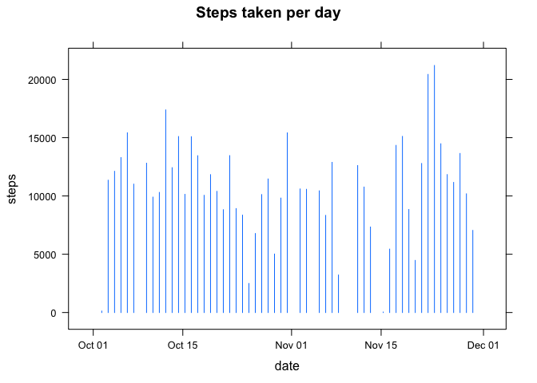
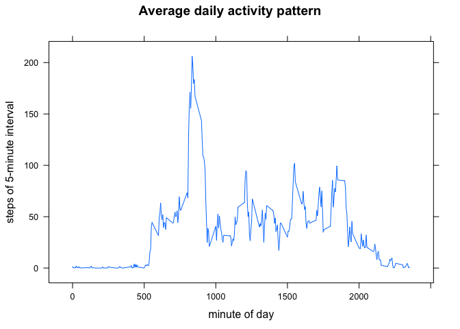
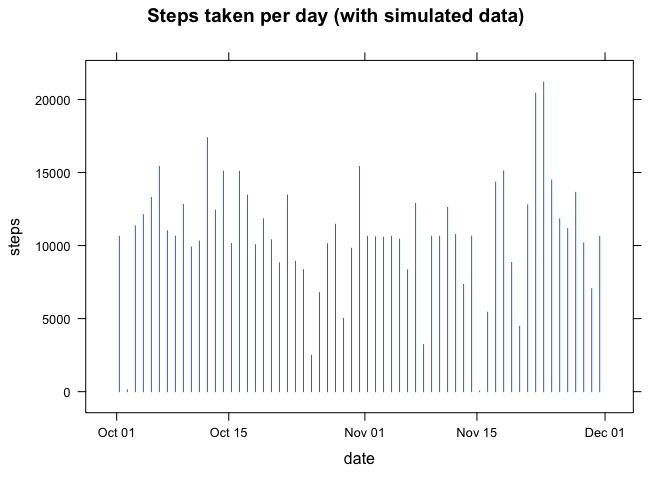
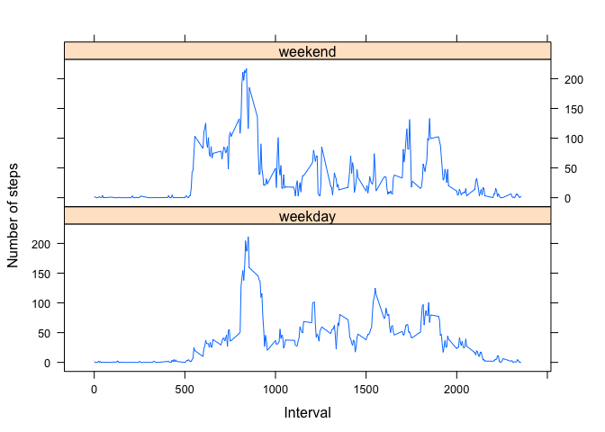

# Reproducible Research: Peer Assessment 1


## Loading and preprocessing the data


```r
require(lubridate)
require(dplyr)
require(lattice)
unzip('activity.zip')
dat <- read.csv('activity.csv')
dat$date <- ymd(dat$date)
```

## What is mean total number of steps taken per day?


```r
stepsPerDay <- summarise(group_by(dat, date), sum(steps))
colnames(stepsPerDay)[2] <- 'steps'
xyplot(steps ~ date, stepsPerDay, type = 'h', main = 'Steps taken per day')
```

 

```r
meanSteps <- as.integer(mean(stepsPerDay$steps, na.rm = TRUE))
medianSteps <- median(stepsPerDay$steps, na.rm = TRUE)
```

The mean of the total number of steps taken per day is 10766, and the median is 10765.

## What is the average daily activity pattern?


```r
stepsPattern <- summarise(group_by(dat, interval), mean(steps, na.rm = TRUE))
colnames(stepsPattern)[2] <- 'steps'
xyplot(steps ~ interval, stepsPattern, type = 'l',
       xlab = 'minute of day', ylab = 'steps of 5-minute interval',
       main = 'Average daily activity pattern')
```

 

```r
maxInterval <- stepsPattern$interval[which.max(stepsPattern$steps)]
```

The 5-minute interval of 835 contains the maximum number of steps on average across all the days in the dataset.

## Imputing missing values


```r
NAsLoc <- which(is.na(dat$steps))
NAsNum <- length(NAsLoc)
dat2 <- dat
for (i in NAsLoc) {
        loc <- which(stepsPattern$interval==dat2$interval[i])
        dat2$steps[i] <- as.integer(stepsPattern$steps[loc])
}
stepsPerDay2 <- summarise(group_by(dat2, date), sum(steps))
colnames(stepsPerDay2)[2] <- 'steps'
xyplot(steps ~ date, stepsPerDay2, type = 'h', 
       main = 'Steps taken per day (with simulated data)')
```

 

```r
meanSteps2 <- as.integer(mean(stepsPerDay2$steps))
medianSteps2 <- median(stepsPerDay2$steps)
```

The mean of the total number of steps taken per day in new dataset is 10749, and the median is 10641. After filling NAs with average daily activity pattern of each interval, the mean of the total number of steps taken per day has increased, but the median has decreased.

## Are there differences in activity patterns between weekdays and weekends?


```r
dat2$day <- as.factor(weekdays(dat2$date))
levels(dat2$day) <- c(Monday='weekday',
                      Tuesday='weekday',
                      Wednesday='weekday',
                      Thursday='weekday',
                      Friday='weekday',
                      Saturday='weekend',
                      Sunday='weekend')
stepsGroup <- summarise(group_by(dat2, interval, day), mean(steps))
colnames(stepsGroup) <- c('Interval', 'day', 'Number of steps')
xyplot(`Number of steps` ~ Interval | day, stepsGroup,
       layout = c(1, 2), type = 'l')
```

 
